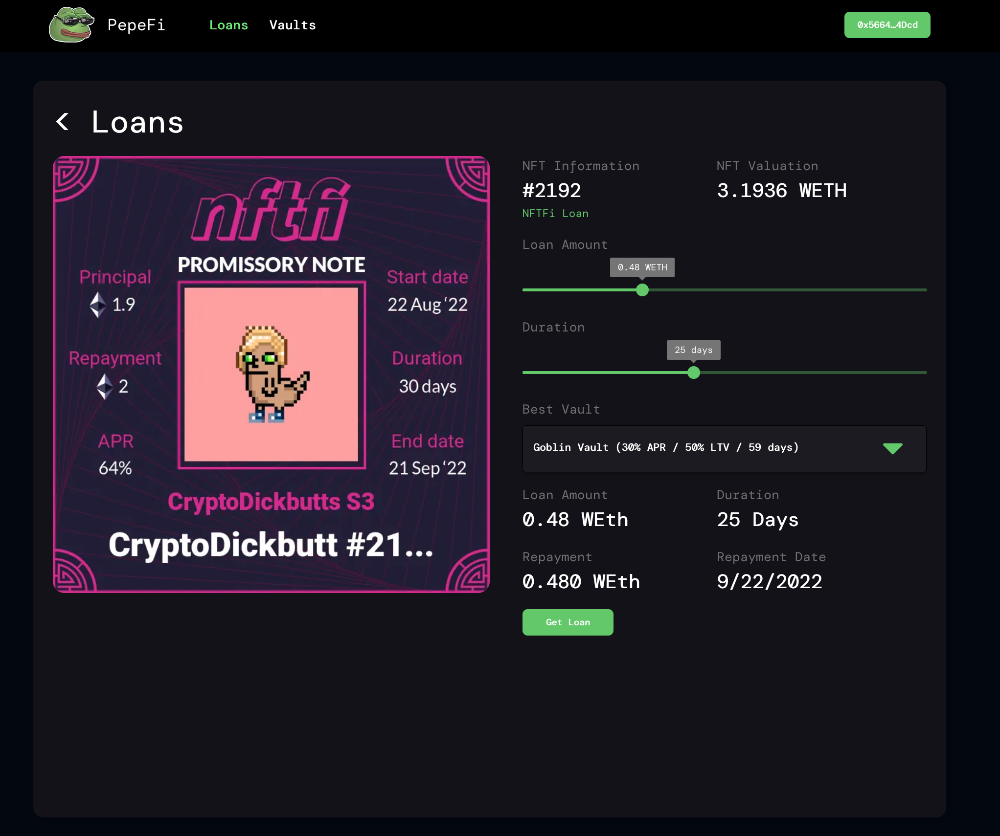
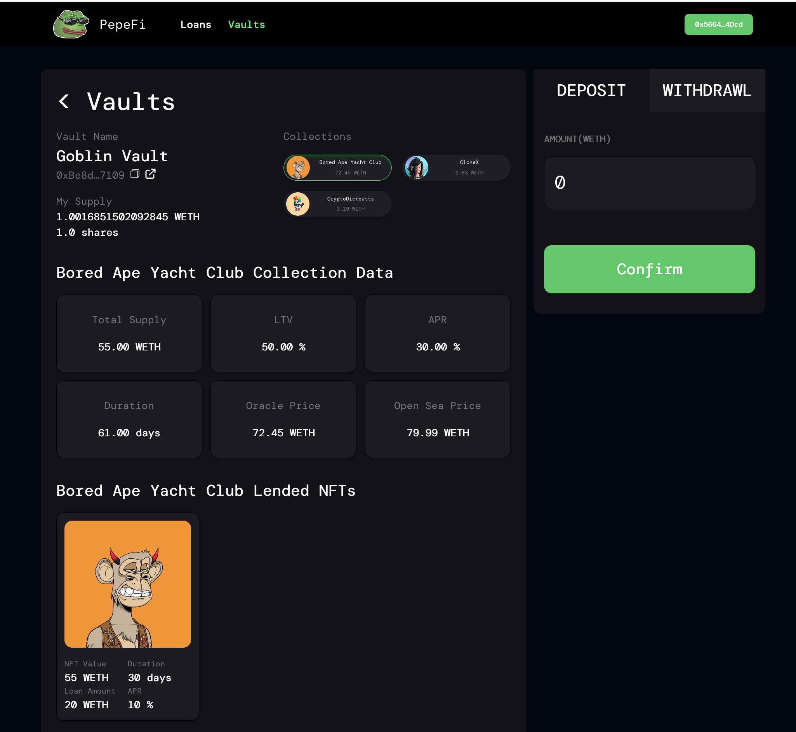

# PepeFi
Made as part of <a href="https://medium.com/macrohacks/macro-hackathons-nft-finance-edition-recap-winner-showcase-8fd3893b206e">MacroHacks Hackathon</a> which we ended up winning. Materials submitted in the hackathon:

* <a href="https://docs.google.com/presentation/d/1hpWRa2PT1i1OqA77zWx4KJCkBIkspA1yNxTaznpO2os/edit#slide=id.g14879f76834_0_10" target="_blank">Pitch Deck</a>

* <a href="https://pepefi.vercel.app/loans" target="_blank">Live Deployment</a>

* <a href="https://www.loom.com/share/c6c4da91f0ac458fa6b4c6beb2eb6046" target="_blank">Demo Video</a>

  
&nbsp; &nbsp; &nbsp; &nbsp;
  

Data from NFTFi shows that:

1) Lenders are happy to hold a negative equity loan. Despite such defaults, lenders yield a higher return than anything else in the Market.
2) More than 50% of borrowers repay their loans even on negative equity. 
3) Most lenders in NFTFi provide a consistent LTV for a given set of collections for a set time. 

PepeFi integrates these concepts in its Vaults. Pepefi allows NFTFi lenders to take a loan on an NFT or on an NFTFi loan whose creators determine APR, LTV, and supported collections. To integrate the changing dynamics of the Market, vaults have an expiry date (Later, to make the life of beginner LPs easy, a protocol can be built on top of PepeFi). Different Vaults will exist at a given time, and anyone can create a vault. Depending on the risk profile of LPs, various Vaults can provide loans on different LTVs and APRs. This creates competition among Vault Creators and LPs, making the Market more efficient for borrowers.

PepeFi doesn't liquidate loans till the end of loan duration, integrating the Market Dynamics. If the loan is still not repaid, liquidators can start a dutch auction which begins at the MIN(1.1 * floor price, repaymentAmount) and decreases by 2% every hour. We do not believe that we can provide loans on NFTs without any drawdown to the LPs; thus, LPs will sometimes take a hit. But data from NFTFi shows that the yield for NFTs is still higher than anything else on the Market despite the default. 

PepeFi creates powerful dynamics for solving most of the problems today. It provides the wider ecosystem access to the lucrative NFT lending market. At the same time, PepeFi creates competition among Vault Creators and LPs, making the Market more efficient. Providing liquidity to NFTFi lenders further increases liquidity in the Market, helping to make NFT Financialization happen. As most loans are much below the LTV, this creates exciting dynamics for the loan on an NFTFi loan. A Vault with a 60% LTV might ensure a 1X leverage loan for the lender if their current LTV is 60%

## Project Repository

The contracts are coded in hardhat inside contracts/ directory. tests are in /tests and deployment scripts are in /scripts. Create .env from .env-example by adding the private key of deployment contract and Alchemy API.

After installing the develepment and normal dependencies, contracts can then be compiled:
>npx hardhat compile

Start a local hardhat instance with a mainnet fork using:
>npx hardhat node

Then deploy the contracts locally and generate config file: 
>npm run build:hardhat

To deploy locally. To deploy on rinkeby:
>npx hardhat run scripts/deploy.js --network rinkeby

While deploying, Oracle price for select collections will be automatically set. To start the oracle scripts which updates price on 5% deviation, start it with:
>npm run start:oracle

To start the rinkeby oracle:
>npx hardhat run scripts/oracle.js --network rinkeby

Then start the application using:
>npm run dev

## Tests
Before running tests, make sure to run npm run build:hardhat to create the configuration file. Then run tests using:
>npm run test

The test script will create a Vault, define a mock oracle price, send NFTs and WETH on the mainnet fork to our wallet, add liquidity to the vault, and create and repay an ERC721 loan and one NFTFi Promissory Note Loan.
